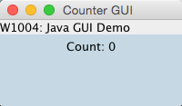
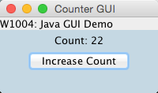

[Java GUI Tutorial](https://github.com/RochesterinNYC/1004-Java-GUI-Tutorial)
---
####1004 - Intro to Computer Science and Programming in Java
-------

This is a tutorial on Java GUIs. Written by James Wen.

-------

###Table of Contents

- [Terms and Definitions](#terms)
- [AWT vs. Swing](#swingawt)
- [Common Java GUI Components](#common)
- [Inheritance](#inheritance)
- [Global Operations](#global)
- [Layouts](#layouts)
- [Event Listening and Processing](#events)
- [Demo](#demo)
- [Other Notes](#other)
- [More Resources/Documentation](#docs)

-------

###Terms and Definitions:

####GUI

- Stands for Graphical User Interface
- A visual interface that allows users to interact with a program or machine
- Uses icons, buttons, windows, and other visual components

####AWT

- Stands for Abstract Window Toolkit
- Set of Java APIs, components, etc. used to create GUIs that are OS-specific

####Swing

- Set of Java APIs, components, etc. used to create GUIs that are OS-portable
- Java Swing is built on top of AWT (Many Swing components uses AWT API and AWT components)

####Heavyweight

- Categorization of a Java GUI Component as having considerable reliance and association with the native screen resource (some operating system resource relating to the actual screen)
- Ex. a Frame that 

####Lightweight

- Categorization of a Java GUI Component as having considerable reliance on the screen resource of an ancestor in the container hierarchy
- No native screen resource
- Ex. a JLabel that is in a JPanel that is in a JFrame relies on the screen resource of the JFrame (that inherits from Frame).

####Event

- Some interaction that a Java class is listening for
- In GUI context, is some interaction between the user and some component or part of a Java GUI

####Event Listener

- A listener that is intended to track when a specific event occurs and execute some functionality/code when the event occurs

####Layouts

- The Java LayoutManagers that dictate how your GUI Components will be arranged in a Container or Container subclass.
- https://docs.oracle.com/javase/tutorial/uiswing/layout/visual.html

------

###AWT vs. Swing:

AWT:

- Uses the native Operating System GUI code/functionality and thus programs with Java AWT work and look different on different operating systems
- Usually looks like a native application for the operating system
- OS-Specific Display: "the same Java program, when run on a Windows PC, would have the look and feel of a native Windows application and the look and feel of a native Mac application when run on a Mac" (http://www.techopedia.com/definition/3735/abstract-window-toolkit-awt)
- Comprised of heavyweight Components

Swing:

- Portable look and functionality across different operating systems
- Usually has the look of a Java application no matter which operating system run on (disregarding themes/skins)
- Java Swing GUI components have a J as the first letter of the class. (Ex. JButton, JLabel)
- Comprised of lightweight Components

Verdict:

Depends on the type and purpose of the Java application you intend to build. However, for W1004, Java Swing will be used.

------

###Common Java GUI Components:

Component (AWT/Swing):

- An object that has a graphical/visual representation that can be displayed to a user and can be interacted with.
- Ex. Buttons, Checkboxes, Textfields
- "Abstract superclass of the non-menu-related AWT components"

Container (AWT/Swing):

- A generic AWT object that is essentially a Component that can hold other AWT Components in it.

Window (AWT)/JWindow (Swing):

- A Container that can be displayed on the user's desktop.
- If something is actually to be displayed to the user, that something (ex. Frame or JFrame) must inherit from Window/JWindow.

Frame (AWT)/JFrame (Swing):

- A top-level, framed window that contains a title and border. Can be closed or minified or etc.
- Frames can be nested within each other. (Reference: http://docs.oracle.com/javase/tutorial/uiswing/components/internalframe.html)

  

Panel (AWT)/JPanel (Swing):

- Container used for organizing and grouping GUI components within frames.
- Used to organize GUI Components (ex. buttons, labels, textfields, etc.).
- Panels can be nested within each other.

Point (AWT/Swing):

- A point with an x/y location.
- Bear in mind that the y axis is flipped in context of Java GUIs. (http://mathbits.com/MathBits/Java/Graphics/GraphingMethods.htm)

Label (AWT)/JLabel (Swing):

- Text or image display that cannot be edited by the user.

  

Button (AWT)/JButton (Swing):

- A button that the user can click.
- Clicking a button will generate an ActionEvent that can be handled by an ActionListener to run some method or code.

  

TextField (AWT)/JTextField (Swing):

- Text/Field for text that can be edited by the user.
- Changing text will generate a TextEvent that can be handled by an TextListener to run some method or code.

  

TextArea (AWT)/JTextArea (Swing):

- Box that holds multiple lines of text. Can either be set to editable by user or uneditable.
- Changing text will generate a TextEvent that can be handled by an TextListener to run some method or code.

  

JRadioButton (Swing):

- An item that can either be selected or deselected.
- Usually part of a group of more than one JRadioButton.
- ButtonGroup used to group JRadioButtons together so that only one radio button in that group can be selected at a time.
- Selecting or deselecting will generate an ItemEvent that can be handled by an ItemListener to run some method or code.

  

CheckBox (AWT)/JCheckBox (Swing):

- A checkbox item that can either be selected or deselected.
- Selecting or deselecting will generate an ItemEvent that can be handled by an ItemListener to run some method or code.

  

------

###Inheritance:

Java AWT is in the java.awt package.

Java Swing is in the javax.swing package.

AWT:

- All GUI components will inherit from `java.awt.Component` which inherits from java.lang.Object.

For a quick overview on the inheritance hierarchy of the most popular AWT GUI components: http://cs.saddleback.edu/rwatkins/CS4A/Section7/Hierarchy.html

- All AWT Events will inherit either directly or indirectly from `java.awt.AWTEvent`, which inherits from `java.util.EventObject` (which inherits from `java.lang.Object`).

Java Swing:

- All GUI components will inherit from `javax.swing.JComponent` which inherits from `java.awt.Container` which inherits from `java.awt.Component`.

For a quick overview on the inheritance hierarchy of the most popular Java Swing GUI components: http://www.comp.nus.edu.sg/~cs3283/ftp/Java/swingConnect/archive/what_is_arch/tool_set/tool_set.html

- Java Swing Events will either inherit from java.util.EventObject directly or indirectly from `java.awt.AWTEvent` and AWT subclasses of `java.awt.AWTEvent` (like `java.awt.event.ComponentEvent`)

------

###Global Operations:

All subclasses that have these classes as superclasses can utilize the following functionalities.

####Component (`java.awt.Component`):

setSize(int width, int height):
- Sets the width and height of the Component.
- Width and height are in pixels.
- Also available: setSize(Dimension d) and setPreferredSize(Dimension preferredSize)
- Also has accessor getSize that returns a Dimension object.

setBackground(Color c):
- Sets the background color for the Component.
- Also has accessor getBackground that returns a Color object.

setFont(Font f):
- Sets the font for the Component.
- Also has accessor getFont that returns a Font object.

setBounds(int x, int y, int width, int height):
- Moves and resizes the Component.
- If considering the Component as a rectangle, the top-left corner is located at the x and y specified and the width and height are as specified by the appopriately named parameters.

####Container (`java.awt.Container`):

add(Component comp):
- Adds the specified Component to the Container.
- Many other overloaded add methods that allow you to add Components to the Container in a certain way or with certain conditions/attributes.
- Also has various getComponent accessors that return a Component object.

remove(Component comp):
- Removes the specified Component from the Container.

setLayout(LayoutManager mgr):
- Sets the layout manager for the Container.
- Also has accessor getLayout that returns a LayoutManager object.

------

###Layouts:

For Java GUIs, LayoutManagers allow you to arrange the GUI components of a Container (or Container subclass) in a predefined and structured visual layout.

- The default LayoutManager for a Container is BorderLayout.

  

- The setLayout(LayoutManager mgr) method of the Container class is used to set the Container's LayoutManager.
- Overlapping of Components is not allowed with default behavior.
- To add a component to a specific area of a Container's layout (ex. PAGE_START area of a BorderLayout), the add(Component comp, Object constraints) method of the Container class is usually used. 
- Example Usage: 

        add(new JLabel("W1004: Java GUI Demo"), BorderLayout.PAGE_START);

- Great Reference: https://docs.oracle.com/javase/tutorial/uiswing/layout/visual.html
------

###Event Listening and Processing:

Inheritance Hierarchy:

`java.awt.AWTEvent` inherits from `java.util.EventObject` inherits from `java.lang.Object`

- `java.util.EventObject` represents an Event. However, the Event concept is not restricted to just GUIs and visual interaction. (Ex. `javax.print.event.PrintEvent` inherits from `java.util.EventObject` and is related to the Java Print API).
- `java.awt.AWTEvent` is an abstract class that represents all Events that have anything to do with AWT and Java GUIs.
- Most of the Events that you would be dealing with in writing AWT or Swing Component GUIs would directly inherit from `java.awt.AWTEvent` (Ex. ActionEvent, ItemEvent, TextEvent, etc.).

Most Common Java GUI Events:

- Whenever a user clicks or interacts with a GUI Component, it'll usually fall under ActionEvent, ItemEvent, or TextEvent.
  - ItemEvent is for when an item is selected or deselected (ex. Checkbox)
  - TextEvent is for when a Component's text has changed) (ex. TextField)
  - ActionEvent is for when some Component related action has occurred (ex. Button and click)

Creating an Event Listener:

- In order to listen and handle an Event, a class that will be the event listener is needed. The event listener class must implement the proper EventListener subinterface.

An example GUI event listener class might look like: 

    class ButtonListener implements ActionListener {
      public void actionPerformed(ActionEvent event){
        System.out.println("Button Pressed!");
      }
    }

- In this example, ActionListener is the EventListener subinterface (ActionListener inherits from EventListener). CountListener is the GUI event listener class. actionPerformed is the method that must be implemented (to fulfill the ActionListener interface).
- actionPeformed takes in the ActionEvent event that represents the GUI interaction event and thus the code in actionPerformed should perform the functionality expected when the event occurs.

Most Common Java GUI Event Listener SubInterfaces:

- ActionListener --> Listens for ActionEvent --> needs implementation of actionPerformed method
- ItemListener --> Listens for ItemEvent --> needs implementation of itemStateChanged method
- TextListener --> Listens for TextEvent --> needs implementation of textValueChanged method

Configuring/Adding the Event Listener:

Say we have a button:

    JButton pressButton = new JButton("Press Me");

And we have the above ButtonListener class available and visible scope-wise. We aim to have an instance of ButtonListener listen for ActionEvents that are created whenever our pressButton is pressed. We set up the Event listening with the following:

    pressButton.addActionListener(new ButtonListener());

Now, whenever the pressButton is pressed by a user in the GUI, the actionPerformed method for that passed in instance of a ButtonListener will be executed ("Button Pressed!" would be printed).

- A similar approach is used for ItemEvents and TextEvents but different addListener methods are utilized and are called on objects of different classes than button related classes in this case.

------

###Demo:

For this GUI Demo, we'll be using Java Swing and making a quick GUI for Counting.

We'll utilize JFrames, JPanels, JLabels, JButtons, ActionEvents and ActionListeners, LayoutManagers, and color styling, sizing, and positioning.

####Initialize:

Create a JFrame.

CounterGUI.java:

    import javax.swing.JFrame;

    public class CounterGUI {
      public static void main(String[] args){
        JFrame counterFrame = new JFrame("W1004 GUI Demo: Counter");
        counterFrame.setDefaultCloseOperation(JFrame.EXIT_ON_CLOSE);
        counterFrame.pack();
        counterFrame.setVisible(true);
      }
    }

- Compiling and running this at this point should result in a small window displayed that you can resize.

  

  

- There is no content yet as we have not added any Components to our counterFrame JFrame.
- setDefaultCloseOperation is used to indicate the behavior when you click to exit out the JFrame.
- pack is used to size the frame so that "all its contents are at or above their preferred sizes".
- setVisible(true) is required to actually have the JFrame show up as visible to the user.

####Panel Creation:

Create a JPanel.

CounterPanel.java:
    
    import java.awt.*;
    import javax.swing.*;

    public class CounterPanel extends JPanel {
      public CounterPanel(){
        setLayout(null);
      }
    }

- We create a CounterPanel class that inherits from JPanel.

CounterGUI.java:

Add the following line after counterFrame is instantiated and assigned.

    counterFrame.getContentPane().add(new CounterPanel());

- We create and add a CounterPanel to our counterFrame.
- Compiling and running this at this point should result in the same display as before. This is because our CounterPanel has no content and no size.

####Set and Use Layout:

Set the Layout for our CounterPanel and create appropriate JPanels to utilize the layout.

CounterPanel.java:

    public class CounterPanel extends JPanel {
      public CounterPanel(){
        setLayout(new BorderLayout());
        JPanel mainPanel = new JPanel();
        add(mainPanel, BorderLayout.CENTER);
      }
    }

- We set an instance of BorderLayout as the LayoutManager for our CounterPanel. We also create a mainPanel JPanel that will house the components we will later implement/create. We then nest mainPanel inside our CounterPanel in the center quadrant for the BorderLayout. (Reference: https://docs.oracle.com/javase/tutorial/uiswing/layout/border.html)
- Compiling and running this at this point should result in the same display as before. This is because although our CounterPanel now has content (mainPanel), mainPanel has no content and no size.
- setLayout takes as an argument an instance of a LayoutManager.
- The reason why mainPanel is necessary is for formatting and positioning Components within the center area of the Layout. We want to apply styling/formatting and positoning for these Containers in context of the center area and not the entire panel (which contains other areas).
- The add method used is an overloaded version that takes in the Component and constraints (BorderLayout.CENTER in this case).

####Set Panel Size:

Set CounterPanel size.

CounterPanel.java:

    public CounterPanel(){
      setLayout(new BorderLayout());
      JPanel mainPanel = new JPanel();
      mainPanel.setPreferredSize(new Dimension(200,80));
      add(mainPanel, BorderLayout.CENTER);
    }
    
- We now set the preferred size of our MainPanel to 200 pixels by 80 pixels.
- Compiling and running this at this point should result in a 200px by 80px window appearing without having to resize. This is because although our CounterPanel has no set size and mainPanel has no content, mainPanel has a preferred size that counterFrame.pack() (in CounterGUI.java) seeks to maintain.

  

- The setPreferredSize method takes in a Dimension object. The Dimenson constructor takes in as parameters an int width in pixels and an int height in pixels.

####Set Background Color:

Set CounterPanel background color.

CounterPanel.java:
    
    public CounterPanel(){
      setLayout(new BorderLayout());
      JPanel mainPanel = new JPanel();
      mainPanel.setPreferredSize(new Dimension (200,80));
      mainPanel.setBackground(new Color(196, 216, 226));
      add(mainPanel, BorderLayout.CENTER);
    }

- We now set the background color of our mainPanel to the color that corresponds with the RGB value (R = 16, G = 101, B = 46) (Columbia Blue).
- Compiling and running this at this point should result in the previous display now with the background color of mainPanel changed appropriately.

  

####Create JLabel:

Create JLabel and add it as a component of a CounterPanel.

CounterPanel.java:
        
    public class CounterPanel extends JPanel {
      private JLabel countLabel;
      private int count;

      public CounterPanel(){
        JPanel mainPanel = new JPanel();
        setLayout(new BorderLayout());
        mainPanel.setPreferredSize(new Dimension (200,80));
        mainPanel.setBackground(new Color(196, 216, 226));

        count = 0;
        countLabel = new JLabel("Count: " + count);
        countLabel.setBounds(60, 20, 80, 50);
        mainPanel.add(countLabel);
      
        add(mainPanel, BorderLayout.CENTER);
      }
    }

- We now instantiate a JLabel countLabel and int count as private instance variables of our CounterLabel class/object. 
- When we construct a CounterPanel object, we also set count to 0, create the JLabel, size and position it appropriately, and then add it to the mainPanel.
- Compiling and running this at this point should result in the previous display now with the GUI displaying the text "Count: 0".

  

- Variables only need to be instance variables of the Panel class if there will be some other class or method that needs access to them. (We'll be adding an ActionListener interfaced class later that'll need access to count and countLabel.)
- Ex. A simple static JLabel that won't be changed can be instantiated within the constructor or possibly even just with the new constructor without assignment to a variable.
- The String argument passed into the JLabel constructor will be what the JLabel text displays.
- The setBounds method sets the width and height of countLabel to 60px and 50px and positions its top-left corner at 70px, 20px (x, y). Notice that the JLabel is centered horizontally. This is because our mainPanel is 200px x 80px, so if the width of the countLabel is 80px and it's positioned 60px from the left, then the right margin is also 60px. (80px on left + 60px width JLabel + 60px on right == 200px width for mainPanel).
- add(countLabel) adds the countLabel JLabel (a Component) to the mainPanel. The add method call is inherited from the Container class.

####Create JLabel and Place in Panel through Layout:

Create new JLabel object and Place in CounterPanel through BorderLayout.

CounterPanel.java:

    public CounterPanel(){
      JPanel mainPanel = new JPanel();
      setLayout(new BorderLayout());
      mainPanel.setPreferredSize(new Dimension (200,80));
      mainPanel.setBackground(new Color(196, 216, 226));

      count = 0;
      countLabel = new JLabel("Count: " + count);
      countLabel.setBounds(60, 20, 80, 50);
      mainPanel.add(countLabel);
    
      add(mainPanel, BorderLayout.CENTER);
      add(new JLabel("W1004: Java GUI Demo"), BorderLayout.PAGE_START);
    }
    
- We create a new JLabel and directly add it to the PAGE_START area of the BorderLayout of CounterPanel.
- Compiling and running this at this point should result in the previous display now with the top layout area should have the text "W1004: Java GUI Demo" and should __NOT__ have the same background color as the mainPanel.

  

####Create JButton:

Create JButton and add it as a component of a CounterPanel.

CounterPanel.java:
    
    public class CounterPanel extends JPanel {
      private JLabel countLabel;
      private int count;

      public CounterPanel(){
        JPanel mainPanel = new JPanel();
        setLayout(new BorderLayout());
        mainPanel.setPreferredSize(new Dimension (200,80));
        mainPanel.setBackground(new Color(196, 216, 226));

        count = 0;
        countLabel = new JLabel("Count: " + count);
        countLabel.setBounds(60, 20, 80, 50);
        mainPanel.add(countLabel);

        JButton countButton = new JButton("Increase Count");
        countButton.addActionListener(new CountListener());
        countButton.setBounds(25, 70, 150, 50);
        mainPanel.add(countButton);        
      
        add(mainPanel, BorderLayout.CENTER);
        add(new JLabel("W1004: Java GUI Demo"), BorderLayout.PAGE_START);        
      }
    }

- We now instantiate a JButton countButton as a private instance variable of our CounterLabel class/object. 
- When we construct a CounterPanel object, we now also create the JButton, size and position it appropriately, and then add it to the CounterPanel.

- Compiling and running this at this point should result in the previous display now with a button (that says "Increase Count") below the "Count: 0" text.

  

- The String argument passed into the JButton constructor will be what the text for the JButton displays.
- The countButton is centered horizontally using the same strategy as denoted in the step before this one.
- Nothing will happen when clicking the Button in the GUI currently as there are no action listeners set up.

####Create ActionListener for JButton:

Create ActionListener for countButton and have it listen for actions/events on countButton.

CounterPanel.java:

    import java.awt.*;
    import javax.swing.*;
    import java.awt.event.*;
    
    public class CounterPanel extends JPanel {
      private JLabel countLabel;
      private int count;

      public CounterPanel(){
        JPanel mainPanel = new JPanel();
        setLayout(new BorderLayout());
        mainPanel.setPreferredSize(new Dimension (200,80));
        mainPanel.setBackground(new Color(196, 216, 226));

        count = 0;
        countLabel = new JLabel("Count: " + count);
        countLabel.setBounds(60, 20, 80, 50);
        mainPanel.add(countLabel);

        JButton countButton = new JButton("Increase Count");
        countButton.addActionListener(new CountListener());
        countButton.setBounds(25, 70, 150, 50);
        mainPanel.add(countButton);        
      
        add(mainPanel, BorderLayout.CENTER);
        add(new JLabel("W1004: Java GUI Demo"), BorderLayout.PAGE_START);        
      }
      private class CountListener implements ActionListener {
        public void actionPerformed(ActionEvent event){
          count += 1;
          countLabel.setText("Count: " + count);
        }
      }
    }

- We now have a nested private class called CountListener that is the listener for the action of our countButton being pressed. On countButton being pressed, we increase the count by 1.
- Compiling and running this at this point should result in the previous display.
- Nothing will seem to happen when clicking the Button in the GUI currently as, even though the instance variable count is updated with each button press, countLabel is not so the display does not change.
- The actionPerformed method is executed every time the countButton is pressed.
- Notice that we now import `java.awt.event.*` for event/action listening.

####Update JLabel on JButton Press:

Update countLabel on countButton press.

CounterPanel.java:
    
    private class CountListener implements ActionListener {
      public void actionPerformed(ActionEvent event){
        count += 1;
        countLabel.setText("Count: " + count);
      }
    }

- We now also update the countLabel with the action of our countButton being pressed. Hence, the GUI and visual display is now accurate.
- Compiling and running this at this point should result in the previous display but pressing the button should increment number displayed after "Count: ".
- The setText method is used to set the text of the JLabel the method is invoked on to the String that's passed in as an argument.

  

####Wrapup:

- The CounterGUI.java and CounterPanel.java are the final programs after all these steps are done.
- Note that the classes are internally organized a bit differently from how they're depicted in this tutorial. It's debated whether it's neater to organize GUI code by functionality (ex. creating components, setting sizes, setting background colors, etc.) or by component (ex. all functionality related to specific JButton, all functionality related to specific JLabel, etc.).

------

###Other Notes:

- Use themes/skins! Ex. http://geeknizer.com/best-java-swing-look-and-feel-themes-professional-casual-top-10/
- Examples of nice looking Java GUIs: SPSS Modeler, Palantir Client
- Stigma
- Java Swing is not thread safe. (https://docs.oracle.com/javase/8/docs/api/javax/swing/package-summary.html#threading)

- Note that x/y coordinates/axes are as following: x = - --> + from left to right, y = - --> + from up to down (reversed from mathematical y axis)

------

###More Resources/Documentation:

- Menu Guide: https://docs.oracle.com/javase/tutorial/uiswing/components/menu.html

- Oracle Documentation/Guide to Swing: https://docs.oracle.com/javase/tutorial/uiswing/components/index.html

- http://en.wikipedia.org/wiki/List_of_widget_toolkits#Based_on_Java

- Weaknesses and Strengths: http://edn.embarcadero.com/article/26970

- Heavyweight vs. Lightweight: http://www.oracle.com/technetwork/articles/java/mixing-components-433992.html

- https://docs.oracle.com/javase/8/docs/api/javax/swing/package-summary.html

- https://docs.oracle.com/javase/8/docs/api/java/awt/package-summary.html